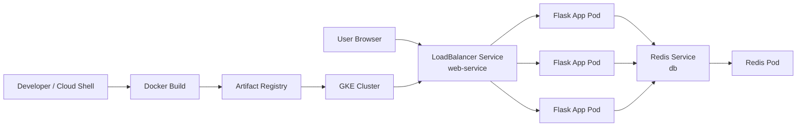

# DevOps Lab Architecture

This repo walks through a simple beginner DevOps flow:

1. Build a Python Flask app locally with Docker.
2. Run the app with Redis using Docker Compose.
3. Push the image to Artifact Registry.
4. Deploy the app to GKE using Kubernetes manifests.

## High-level architecture

## What each part does

### Developer / Cloud Shell
This is where you write the code, build the image, and run the deployment commands.

### Docker Build
Docker packages the Flask app into a container image so it runs consistently.

### Artifact Registry
Artifact Registry stores the built image so GKE can pull it.

### GKE Cluster
GKE runs the app as Kubernetes workloads.

### LoadBalancer Service
This creates the public entry point for the app.

### Flask App Pods
These are the running copies of the web application.

### Redis Service and Pod
Redis provides the simple backing data store used for the visitor counter.

## Why this diagram is useful in a handover

It gives a new learner or teammate a quick picture of:

- where the app runs locally
- where the container image is stored
- how traffic reaches the app in Kubernetes
- how the app talks to Redis

## Suggested next improvement

Once you have real deployment screenshots, link them from the README so the repo feels more like a complete guided lab.